# ffmpeg-stream-GUI

## Layout

The **Streams** tree view shows all the files loaded, and the streams included in each. Each stream is identified by its parent file, its file and stream index, and the type of track it is. Individual streams can be dragged and reordered in the tree view.

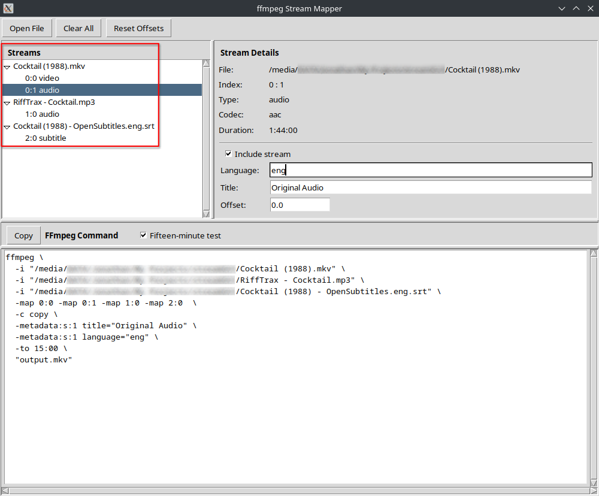

The **Stream Details** right pane shows the details of the currently-selected stream. The top details are mostly immutable and the bottom items can be edited.

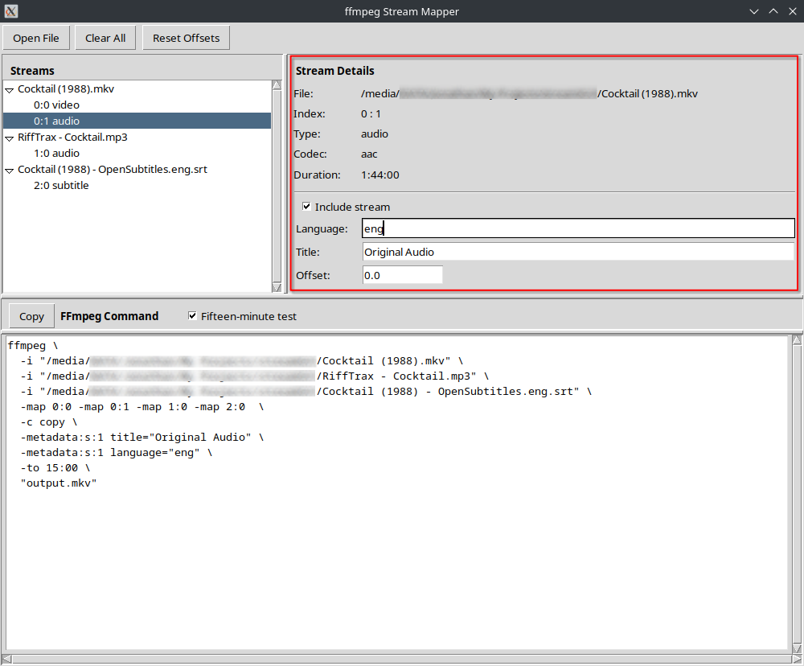

The **FFmpeg Command** bottom pane shows the resulting ffmpeg command generated based on the user inputs.

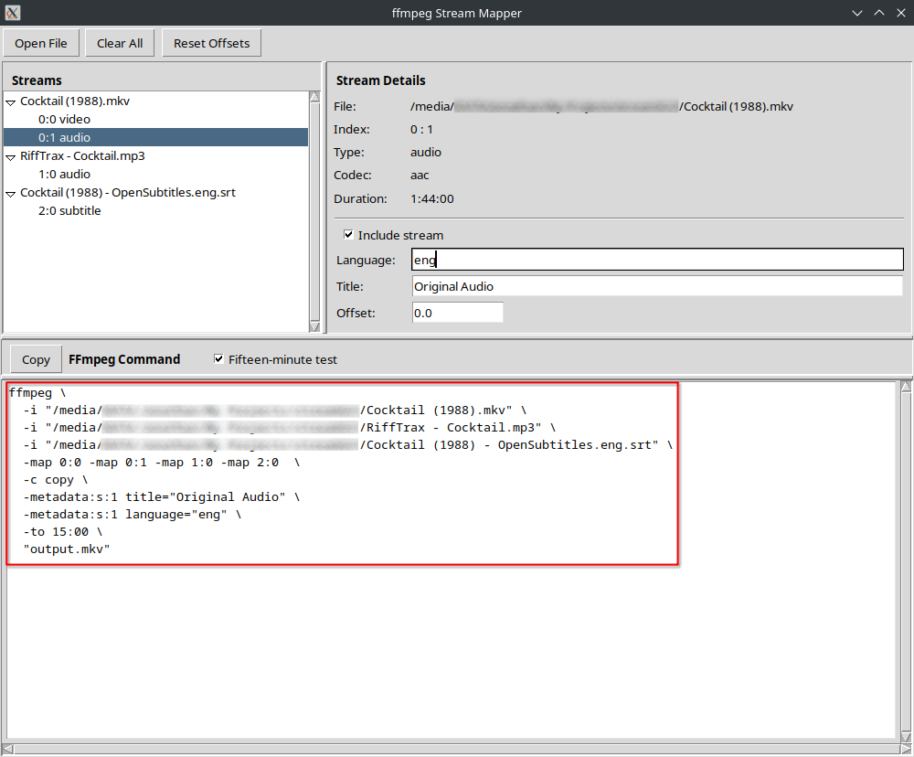

## Menu Operations

**Open File** triggers the Open dialogue, to add a new file and its streams. New files and streams are added into the tree view.

**Clear All** Removes all files and streams from the tree view and clears the current command text.

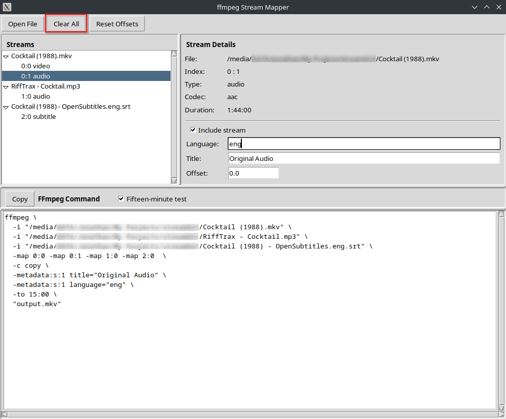

**Reset Offsets** Sets all Offset values, for all streams, back to 0.0.

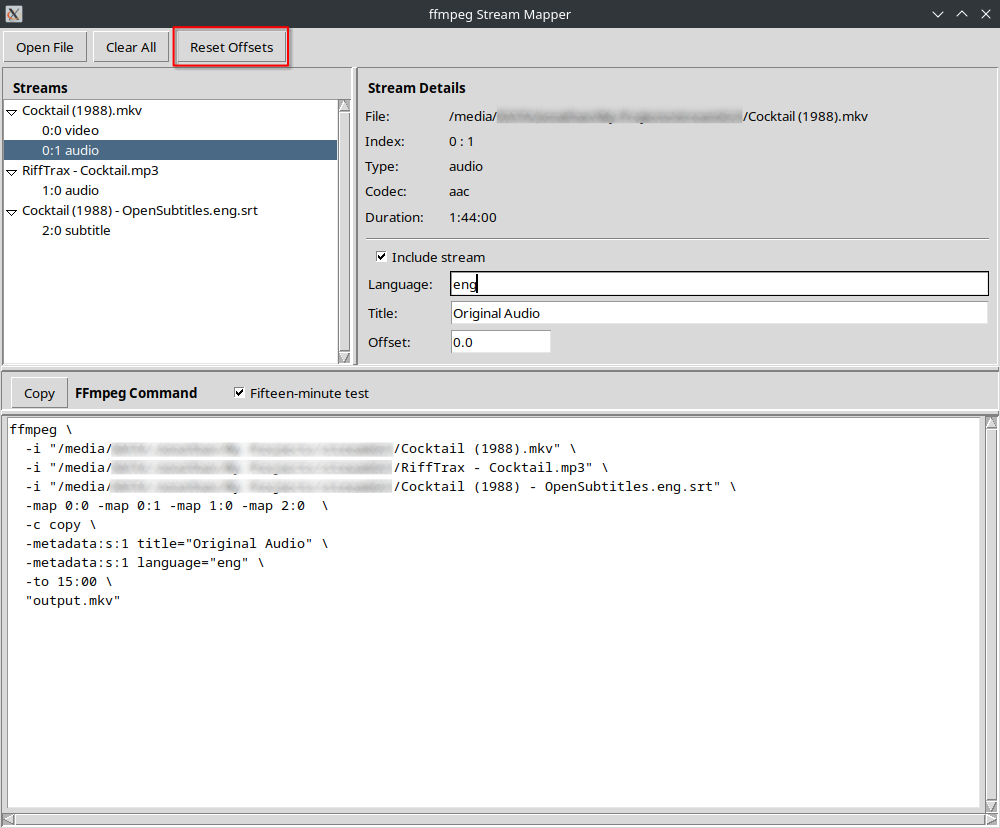

## Stream Details

The immutable attributes of each stream include:
- The **File** path and name of the currently-selected file
- The **Index** of the file and stream
    - These values are automatically updated when the streams are reordered by dragging in the **Stream** tree view, or when the **Offset** values are updated
- The **Type** shows the type of stream
- The **Codec** shows the codec of the stream
- The **Duration** shows the duration of the stream

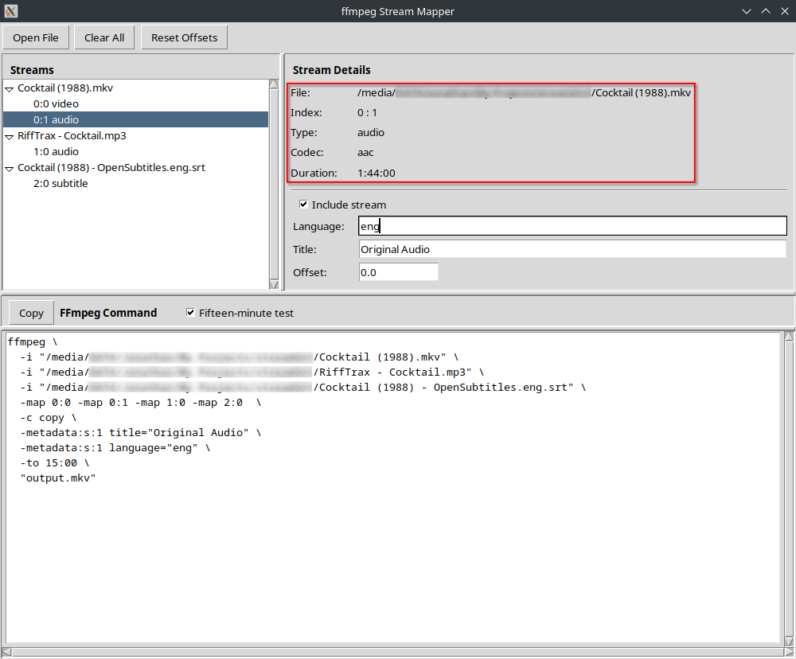

The editable properties of each stream include:
- The **Include stream** checkbox, which determines if the selected stream should be included in the output. This is checked by default for all streams
- The **Language** entry box, which allows you to set the metadata language tag for the stream in the output. The value is set to the original value of the stream, if it exists
- The **Title** entry box, which allows you to set the title language tag for the stream in the output. The value is set to the original value of the stream, if it exists
- The **Offset** entry box, which allows you to set the `itsoffset` attribute of the stream in the output. If two streams in the same file need different offsets, the file path is duplicated automatically with a separate offset value. The default value is set to 0.0

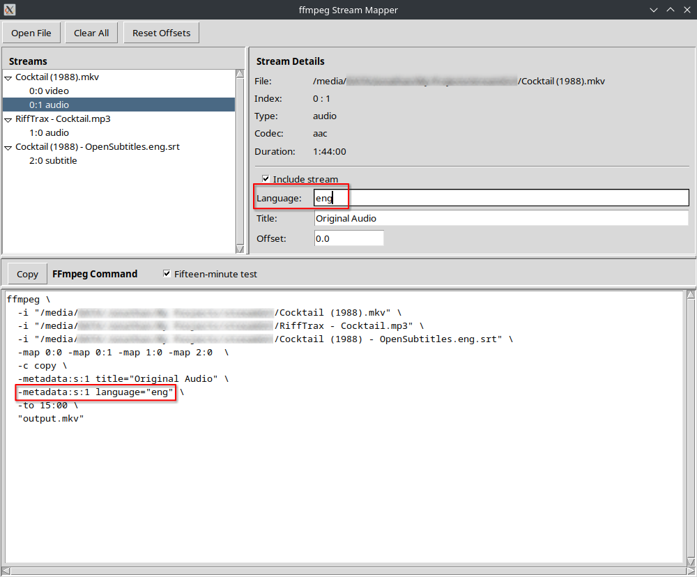

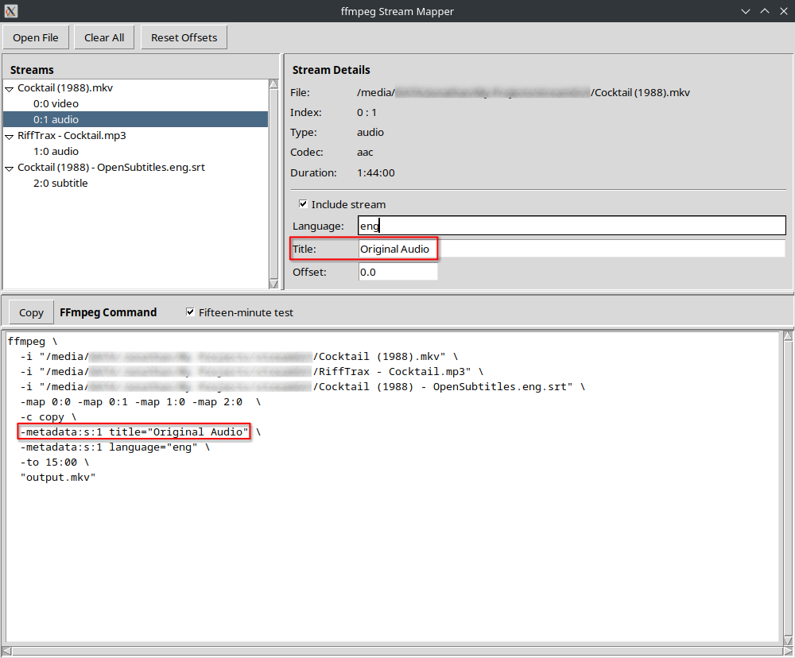

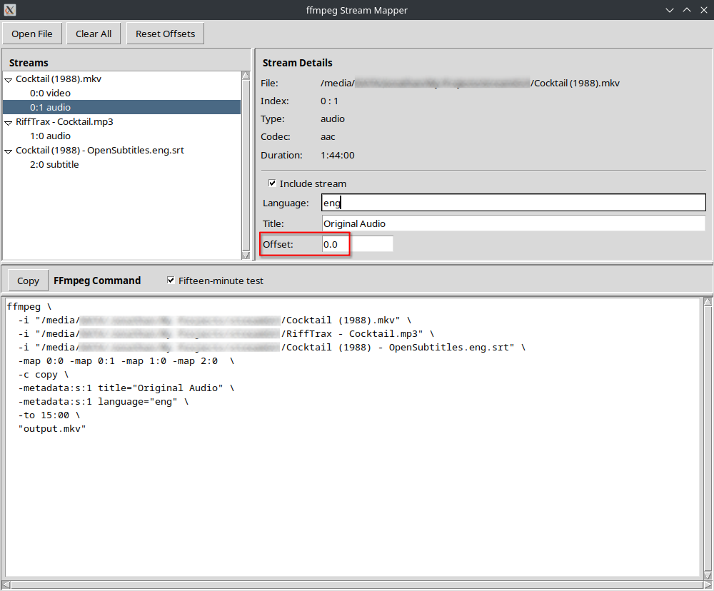

## FFmpeg Command

The **Copy** button copies the currently-displayed command to the clipboard

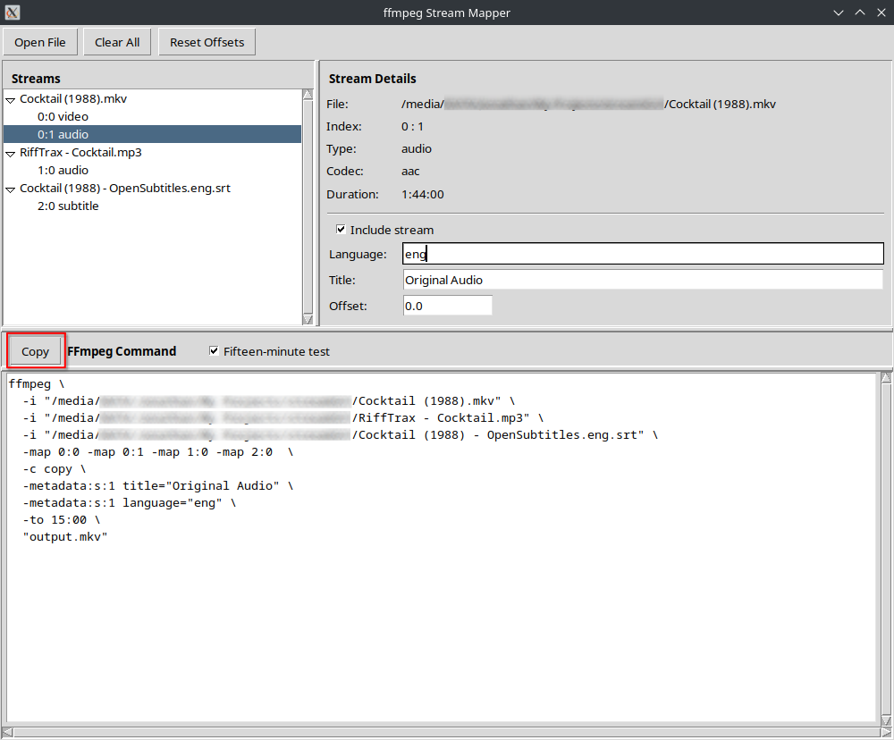

The **Fifteen-minute test** checkbox toggles the inclusion of the `-to 15:00` argument in the command, which can be used to quickly test the sync of various streams if needed. The checkbox is checked by default.

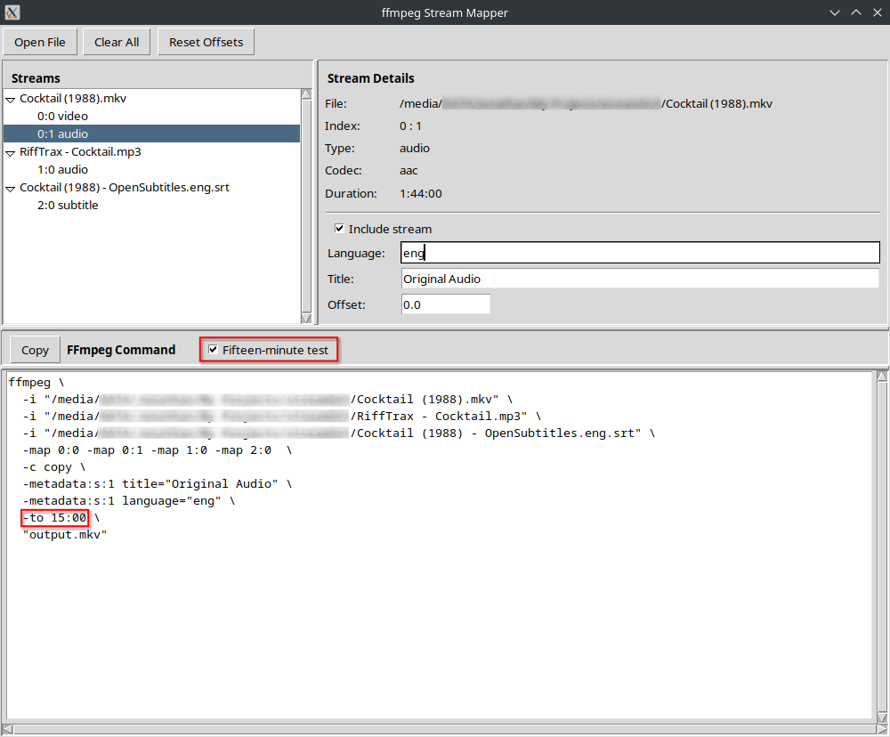

